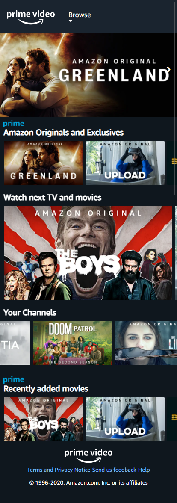

# Procesverslag
**Auteur:** Adriaan van der Heijden

## Bronnenlijst
1. https://www.primevideo.com/
2. https://codepen.io/shooft/pen/zYqJLvZ

## Eindgesprek (week 7/8)

Alles ging goed alleen vond ik de gradient responsive fixen op de detail pagina lastig.

**Screenshot(s):**

Home

Detail

## Voortgang 3 (week 6)

### Stand van zaken
De home pagina is bijna af en de detail pagina ben ik aan begonnen.

Home 0.3

### Verslag van meeting
De Home pagina is al bijna af. Alleen moet ik alle classes verwijderen en alles via css ophalen. De detail pagina is nog karig.

## Voortgang 2 (week 5)

### Stand van zaken
Het gaat goed de header is helemaal klaar en werkend met javascript. De rest nog niet veranderd.

Home 0.2

### Verslag van meeting
De header werkt helemaal. Nog niet de goede font. De tweede pagina ben ik nog niet aan begonnen.

## Voortgang 1 (week 3)

### Stand van zaken

Het gaat goed, ik heb nog niet veel gedaan.

**Screenshot(s):**
Home 0.1

### Verslag van meeting
De home pagina had een begin. En de header had al een begin. De tweede pagina was nog niks. Dus ik moest door werken aan de home pagina en een begin maken aan de tweede pagina.

## Breakdownschets (week 1)

## Intake (week 1)
-uitwerken voor de kick-off werkgroep - begin van de eerste week-

**Je startniveau:** Zwart

**Je focus:** Responsive

**Je opdracht:** https://www.primevideo.com/

**Screenshot(s) van de eerste pagina (small screen):**

**Screenshot(s) van de tweede pagina (small screen):**

