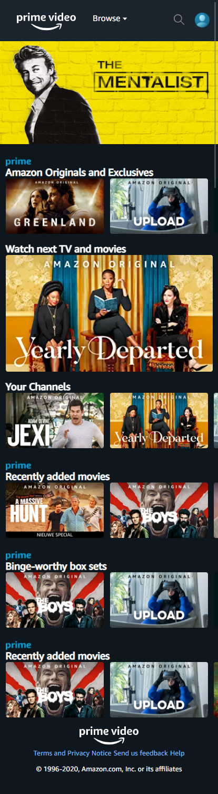
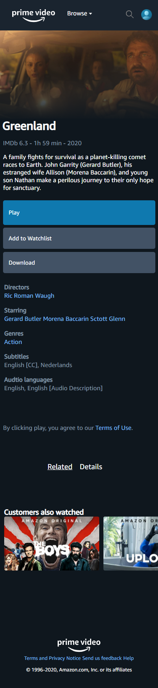
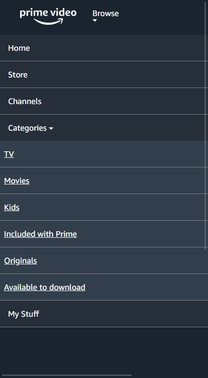
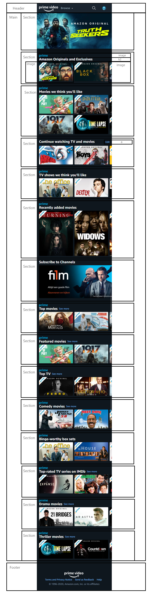
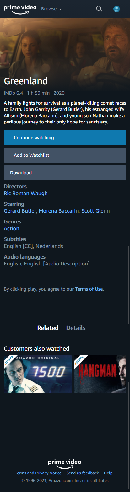

# Procesverslag
**Auteur:** Adriaan van der Heijden

Markdown cheat cheet: [Hulp bij het schrijven van Markdown](https://github.com/adam-p/markdown-here/wiki/Markdown-Cheatsheet). Nb. de standaardstructuur en de spartaanse opmaak zijn helemaal prima. Het gaat om de inhoud van je procesverslag. Besteedt de tijd voor pracht en praal aan je website.

## Bronnenlijst
1. https://www.primevideo.com/

## Eindgesprek (week 7/8)

-dit ging goed & dit was lastig-

**Screenshot(s):**

Home

Detail

## Voortgang 3 (week 6)

-same as voortgang 1-

## Voortgang 2 (week 5)

### Stand van zaken
Het gaat goed de header is helemaal klaar en werkend met javascript.

Home 0.2

## Voortgang 1 (week 3)

### Stand van zaken

Het gaat goed, ik heb nog niet veel gedaan.

**Screenshot(s):**
Home 0.1

### Verslag van meeting
De home pagina had een begin. En de header had al een begin. De tweede pagina was nog niks. Dus ik moest door werken aan de home pagina en een begin maken aan de tweede pagina.

## Breakdownschets (week 1)

## Intake (week 1)
-uitwerken voor de kick-off werkgroep - begin van de eerste week-

**Je startniveau:** Zwart

**Je focus:** Responsive

**Je opdracht:** https://www.primevideo.com/

**Screenshot(s) van de eerste pagina (small screen):**

**Screenshot(s) van de tweede pagina (small screen):**

